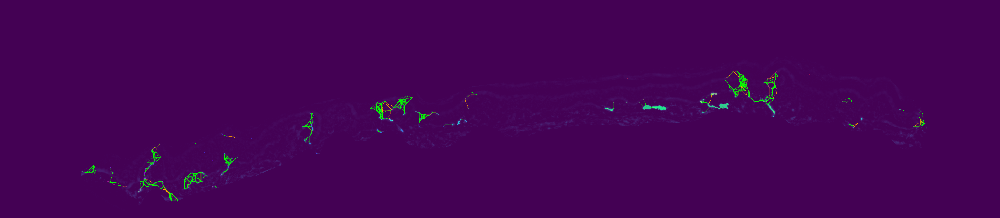

# IENF-Q: 神經纖維量化與重建系統

IENF-Q (Intra-Epidermal Nerve Fiber Quantification) 是一個全自動的分析流程，旨在從顯微鏡影像和稀疏的手動標註中重建完整的神經纖維網絡。本系統採用傳統電腦視覺演算法，確保了結果的可解釋性、可控性和穩定性。



## 🚀 功能特性

- **極簡輸入**: 僅需一張原始影像和一張標註影像即可開始。
- **全自動化**: 從前處理到最終重建，無需人工干預。
- **演算法驅動**: 基於骨架分析、A\*路徑尋找和最小生成樹 (MST) 等可解釋的演算法。
- **曲率感知**: 獨特的種子點提取策略，能準確保留神經纖維的彎曲和分支特徵。
- **高度可配置**: 所有關鍵參數均可透過 `config/default.yaml` 或命令列進行調整。
- **可視化輸出**: 產生豐富的視覺化結果，便於分析和驗證。

## 📂 專案結構

```
.
├── config/
│   └── default.yaml         # 預設設定檔
├── data/
│   ├── Original/            # 原始影像存放處
│   └── Label/               # 標註影像存放處
├── output/                  # 結果輸出目錄
├── src/
│   ├── nueral_reconstruction/ # 重建核心演算法
│   └── preprocessing/         # 影像前處理模組
├── tools/                   # 輔助工具腳本
├── run_pipeline.py          # 主要執行腳本
└── README.md                # 本文件
```

## 🛠️ 安裝

本專案使用 `uv` 作為套件管理工具。

1.  **安裝依賴**
    ```bash
    uv sync
    ```

## 🏃‍♂️ 快速開始

使用 `run_pipeline.py` 腳本來啟動完整的分析流程。

**基本用法:**

```bash
python run_pipeline.py \
    --image /path/to/your/original_image.png \
    --annotation /path/to/your/annotation_mask.png \
    --output /path/to/your/output_directory
```

### 命令列參數

- `--image`: (必需) 原始的 RGB 或灰階顯微鏡影像路徑。
- `--annotation`: (必需) 二值化的手動標註影像路徑 (神經纖維為白色)。
- `--output`: (必需) 用於存放最終結果的輸出目錄。
- `--config`: (可選) 指定一個 YAML 設定檔來覆蓋預設值。預設為 `config/default.yaml`。
- `--save-intermediates`: (可選) 如果啟用，將在輸出目錄的 `intermediates/` 子目錄中保存所有中間步驟的結果（如綠色通道、骨架、種子點等），便於除錯。

## ⚙️ 設定

您可以透過修改 `config/default.yaml` 或在執行時傳遞參數來客製化分析流程。

### 主要可調參數

- **`seed_extraction.base_segment_length`**: 沿骨架放置種子點的基礎分段長度。
- **`component_pairing.max_distance_threshold`**: 連接不同標註區塊的最大搜尋距離。
- **`component_pairing.max_cost_threshold`**: A\* 尋路演算法可接受的最大路徑成本。

**透過命令列覆蓋設定:**

```bash
# 範例：使用更嚴格的連接閾值
python run_pipeline.py \
    --image <path> --annotation <path> --output <path> \
    --set component_pairing.max_cost_threshold=0.95
```

## 🔬 演算法流程

系統的重建過程主要分為六個階段：

1.  **影像前處理**: 從原始 RGB 影像中提取綠色通道，因為神經組織在該通道有最強的訊號響應。
2.  **標註處理**: 對二值化的標註影像進行連通元件分析，將不連續的標註區塊分離出來。
3.  **骨架化**: 對每個連通元件進行骨架化，提取其拓撲結構的中心線。
4.  **種子點提取**: 沿著骨架以曲率感知的方式提取"種子點"。在神經彎折處會策略性地放置更多種子，以確保重建的幾何保真度。
5.  **網路建構**: 以所有種子點為節點，使用 A\* 演算法在成本地圖（由綠色通道影像生成）上尋找潛在的連接路徑，並根據幾何距離、影像特徵和路徑曲率計算綜合成本。
6.  **神經重建**: 在所有潛在連接構成的圖中，使用基於 Kruskal 演算法的約束最小生成樹 (MST) 來找出最優的連接，形成最終的神經纖維森林。

## 📊 輸出結果

執行完成後，您將在指定的輸出目錄中找到以下檔案：

- `mst_visualization/mst_reconstruction.png`: 最終重建的神經網絡疊加在原始影像上的視覺化結果。
- `component_pairing_visualization/pairing_overview.png`: 組件配對的概覽圖。
- `seeds/seeds_overlay.png`: 提取的種子點分佈圖。
- 以及各個階段的詳細 `json` 數據和統計資訊。

## 🤝 貢獻

歡迎提交 Pull Requests 或回報 Issues。

## 📄 授權

本專案採用 MIT 授權。
